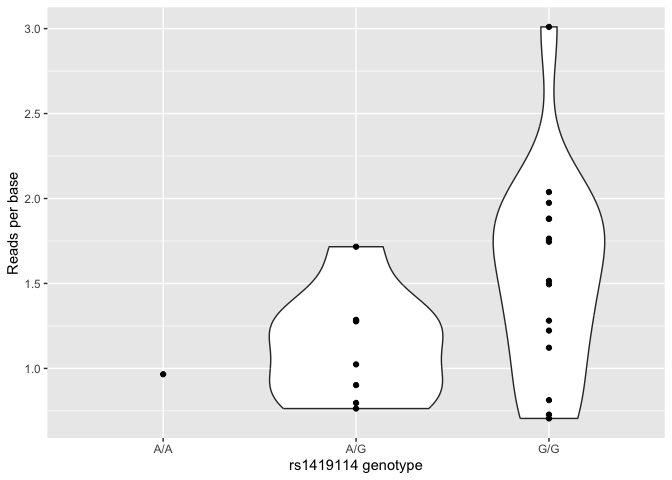

Linear Regression Analysis 1 in R
================

## GitHub Documents

This is an R Markdown format used for publishing markdown documents to
GitHub. When you click the **Knit** button all R code chunks are run and
a markdown file (.md) suitable for publishing to GitHub is generated.

## Including Code

You can include R code in the document as follows:

``` r
summary(cars)
```

    ##      speed           dist       
    ##  Min.   : 4.0   Min.   :  2.00  
    ##  1st Qu.:12.0   1st Qu.: 26.00  
    ##  Median :15.0   Median : 36.00  
    ##  Mean   :15.4   Mean   : 42.98  
    ##  3rd Qu.:19.0   3rd Qu.: 56.00  
    ##  Max.   :25.0   Max.   :120.00

## Including Plots

You can also embed plots, for example:

<!-- -->

Note that the `echo = FALSE` parameter was added to the code chunk to
prevent printing of the R code that generated the plot.

# Getting started: linear regression

### Prequisites

For this tutorial you will need to have [installed R and
Rstudio](/prerequisites/R.md). We will use R to analyse some expression
data. I’ll also be using the [tidyverse](/prerequisites/tidyverse.md) in
examples.

### Getting the data

In this part of the practical we will use linear regression to estimate
the possible effect of a genotype on gene expression values. To get
started, create a new empty directory and change into it:

    mkdir regression_tutorial
    cd regression_tutorial

The data can be found in [this
folder](https://github.com/whg-training/whg-training-resources/tree/main/docs/statistical_modelling/regression_modelling/data/malariagen) -
download the file `atp2b4_per_gene_data.tsv` and place it in your
folder:

    curl -O https://raw.githubusercontent.com/whg-training/whg-training-resources/main/docs/statistical_modelling/regression_modelling/data/malariagen/atp2b4_per_gene_data.tsv

(Or use the [direct link](./data/malariagenatp2b4_per_gene_data.tsv).)

Start an R session and make sure you are working in this directory
(e.g. using `setwd()` or `Session` -\> `Set Working Directory` in
RStudio). Let’s load the data now and take a look:

``` r
options(repos = c(CRAN = "https://cran.rstudio.com/"))
setwd("~/Library/CloudStorage/OneDrive-QueenMary,UniversityofLondon/4. Self-learning/WHG training/whg-training-resources-replicate/docs/statistical_modelling/regression_modelling/data")
library(tidyverse)
data <- read_delim("atp2b4_per_gene_data.tsv", delim = "\t") 
```

:::tip Note I am using the [tidyverse](https://www.tidyverse.org) for
these examples. If you don’t have it installed, either install it or use
base R (e.g. `read.delim()`) instead. :::

### What’s in the data?

The data represents gene expression values (expressed as the mean number
of RNA-seq reads per base, averaged across the gene exons) for the gene
*ATP2B4*. The data comes from [this
paper](https://doi.org/10.1172/JCI94378) which reported that local
genotypes - including at the SNP rs1419114 - are associated with
expression changes. Let’s see if we can reconstruct this.

:::tip Note

Gene quantification is usually measured in more sophisticated units -
‘transcripts per million’ (TPM) or ‘fragments per kilobase per
million’\`(FPKM). They involve scaling by the computed value across all
genes, which helps to normalise for variation in expression of other
genes. We’ll skip that here but you should consider it if doing a real
transcriptomic study.

:::

### Quick look at the genotypes:

First let’s rename the genotype column - too long!

``` r
head(data)
```

    ## # A tibble: 6 × 10
    ##   sample                 stage tissue rs1419114_A>G_genoty…¹ gene   start    end
    ##   <chr>                  <chr> <chr>  <chr>                  <chr>  <dbl>  <dbl>
    ## 1 Bone_marrow_erythrobl… adult bone_… A/G                    ATP2… 2.04e8 2.04e8
    ## 2 Bone_marrow_erythrobl… adult bone_… G/G                    ATP2… 2.04e8 2.04e8
    ## 3 Bone_marrow_erythrobl… adult bone_… G/G                    ATP2… 2.04e8 2.04e8
    ## 4 Bone_marrow_erythrobl… adult bone_… A/G                    ATP2… 2.04e8 2.04e8
    ## 5 Bone_marrow_erythrobl… adult bone_… A/G                    ATP2… 2.04e8 2.04e8
    ## 6 Bone_marrow_erythrobl… adult bone_… G/G                    ATP2… 2.04e8 2.04e8
    ## # ℹ abbreviated name: ¹​`rs1419114_A>G_genotype`
    ## # ℹ 3 more variables: mean_reads_per_exon <dbl>, mean_reads_per_base <dbl>,
    ## #   total_reads <dbl>

``` r
colnames(data)[4] = "genotype"
```

Let’s look at this column now:

``` r
table(data$genotype)
```

    ## 
    ## A/A A/G G/G 
    ##   1   8  15

:::tip Question

How many samples are in the data? How many of each genotype? There are
24 samples in the data. As the table show above, each geno type has 1,8,
15 samples respectively. :::

There’s only one A/A genotype in the data. This might look a bit odd at
first, but if you look up rs1419114 on <https://ensembl.org> you’ll see
why. The frequency of the `A` allele in non-African populations is
around $\frac{1}{10}$ or less. So assuming the two chromosomes are drawn
independently we’d only expect about $24 \times \frac{1}{100}$, so not
so surprising we got only one.

## Is rs1419114 associated with *ATP2B4* expression?

### Plotting the relationship

The best way to start figuring this out is by plotting:

``` r
library( ggplot2 )
(
    ggplot( data = data, aes( x = genotype, y = mean_reads_per_base ))
    + geom_violin()
    + geom_point()
    + xlab( "rs1419114 genotype" )
    + ylab( "Reads per base")
)
```

    ## Warning: Groups with fewer than two datapoints have been dropped.
    ## ℹ Set `drop = FALSE` to consider such groups for position adjustment purposes.

<!-- -->
