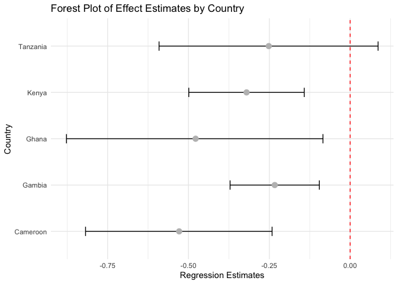

import Tabs from ‘@theme/Tabs’; import TabItem from ‘@theme/TabItem’;

# Logistic regression

Before moving on let’s try a different type of regression: *logistic
regression*. Unlike linear regression, which models a continuously
varying outcome variable (such as expression levels), logistic
regression models a binary 0/1 outcome - or more generally *binomial*
(count) or *multinomial* (categorical) outcome.

## Prerequisites

To get started, download the file ‘o_bld_group_data.csv’ from \[this
folder\](The data can be found in [this
folder](https://github.com/whg-training/whg-training-resources/tree/main/docs/statistical_modelling/regression_modelling/data/) -
and place it in your folder. E.g. from the command line:

    curl -O https://raw.githubusercontent.com/whg-training/whg-training-resources/main/docs/statistical_modelling/regression_modelling/data/o_bld_group_data.tsv

(Or use the [direct link](./data/o_bld_group_data.tsv).)

Now load it into your R session:

``` r
library(tidyverse)
```

    ## ── Attaching core tidyverse packages ──────────────────────── tidyverse 2.0.0 ──
    ## ✔ dplyr     1.1.4     ✔ readr     2.1.5
    ## ✔ forcats   1.0.0     ✔ stringr   1.5.1
    ## ✔ ggplot2   3.5.2     ✔ tibble    3.3.0
    ## ✔ lubridate 1.9.4     ✔ tidyr     1.3.1
    ## ✔ purrr     1.0.4     
    ## ── Conflicts ────────────────────────────────────────── tidyverse_conflicts() ──
    ## ✖ dplyr::filter() masks stats::filter()
    ## ✖ dplyr::lag()    masks stats::lag()
    ## ℹ Use the conflicted package (<http://conflicted.r-lib.org/>) to force all conflicts to become errors

``` r
data = read_delim( "o_bld_group_data.tsv", delim = "\t" )
```

    ## Rows: 10916 Columns: 12
    ## ── Column specification ────────────────────────────────────────────────────────
    ## Delimiter: "\t"
    ## chr (7): sample_id, country, genotyped_sex, ethnicity, status, rs8176719, rs...
    ## dbl (5): PC_1, PC_2, PC_3, PC_4, PC_5
    ## 
    ## ℹ Use `spec()` to retrieve the full column specification for this data.
    ## ℹ Specify the column types or set `show_col_types = FALSE` to quiet this message.

## What’s in the data?

The data contains genotype calls for the genetic variants rs8176719 and
rs8176746, measured in a set of severe malaria cases and population
controls from several African countries. These variants lie in the *ABO*
gene and together encode the most common ABO blood group types.

The data were collected by seperatecase-control studies operating in
each country and were genotyped by
[MalariaGEN](https://www.malariagen.net). They were described in [this
paper](https://doi.org/10.1038/s41467-019-13480-z).

Before starting explore the data (e.g. using `View()`, `table()` and so
on) and make sure you know what is in there. You should see:

``` r
head(data)
```

    ## # A tibble: 6 × 12
    ##   sample_id  country genotyped_sex ethnicity  status rs8176719 rs8176746    PC_1
    ##   <chr>      <chr>   <chr>         <chr>      <chr>  <chr>     <chr>       <dbl>
    ## 1 EXNMY8743H Gambia  M             ethnicity… CASE   -/C       G/T        0.0100
    ## 2 HEQVB6322Z Gambia  F             ethnicity… CASE   -/-       G/G        0.0593
    ## 3 CGARJ3859K Gambia  F             ethnicity… CASE   C/C       G/T        0.0301
    ## 4 WQVWO2433A Gambia  M             ethnicity… CASE   -/-       G/G        0.0214
    ## 5 AJNTO3047P Gambia  M             ethnicity… CASE   -/-       G/G       -0.0696
    ## 6 IMJJY8783Q Gambia  F             ethnicity… CASE   -/-       G/G        0.0579
    ## # ℹ 4 more variables: PC_2 <dbl>, PC_3 <dbl>, PC_4 <dbl>, PC_5 <dbl>

``` r
summary(data)
```

    ##   sample_id           country          genotyped_sex       ethnicity        
    ##  Length:10916       Length:10916       Length:10916       Length:10916      
    ##  Class :character   Class :character   Class :character   Class :character  
    ##  Mode  :character   Mode  :character   Mode  :character   Mode  :character  
    ##                                                                             
    ##                                                                             
    ##                                                                             
    ##                                                                             
    ##     status           rs8176719          rs8176746              PC_1         
    ##  Length:10916       Length:10916       Length:10916       Min.   :-0.33671  
    ##  Class :character   Class :character   Class :character   1st Qu.:-0.03290  
    ##  Mode  :character   Mode  :character   Mode  :character   Median : 0.01075  
    ##                                                           Mean   : 0.00020  
    ##                                                           3rd Qu.: 0.03481  
    ##                                                           Max.   : 0.21610  
    ##                                                           NA's   :491       
    ##       PC_2               PC_3               PC_4               PC_5         
    ##  Min.   :-0.29088   Min.   :-0.57375   Min.   :-0.32545   Min.   :-0.18563  
    ##  1st Qu.:-0.02500   1st Qu.:-0.01537   1st Qu.:-0.01200   1st Qu.:-0.01062  
    ##  Median :-0.00607   Median :-0.00352   Median : 0.00195   Median :-0.00158  
    ##  Mean   :-0.00006   Mean   :-0.00008   Mean   : 0.00001   Mean   :-0.00005  
    ##  3rd Qu.: 0.02056   3rd Qu.: 0.01245   3rd Qu.: 0.01466   3rd Qu.: 0.00842  
    ##  Max.   : 0.16254   Max.   : 0.22290   Max.   : 0.33565   Max.   : 0.48898  
    ##  NA's   :491        NA's   :491        NA's   :491        NA's   :491

- Information on the sample identifier and sex, and ethnicity

- The `status` column, which indicates if the sample was collected as a
  case (i.e. came into hospital with severe symptoms of malaria) or a
  control

- A column with the rs8176719 genotypes and one with the rs8176746
  genotypes.

- And some columns marked `PC_1` - `PC_5`.

:::tip Warm-up question

O blood group is encoded by a homozygous deletion (`-/-` at rs8176719).
What is the frequency of O blood group in this sample in each
population?

``` r
data %>% group_by(country) %>% 
    summarise(n = sum(rs8176719 == "-/-", na.rm = TRUE), o_bld_freq = n/n()*100)
```

    ## # A tibble: 5 × 3
    ##   country      n o_bld_freq
    ##   <chr>    <int>      <dbl>
    ## 1 Cameroon   586       48.8
    ## 2 Gambia    2152       42.7
    ## 3 Ghana      280       39.6
    ## 4 Kenya     1546       48.4
    ## 5 Tanzania   350       45.1

In non-O individuals, B blood group is encoded by the ‘T’ allele of
rs8176746. What is the frequency of B blood group in non-O-blood group
individuals in each country?

``` r
data %>% filter(rs8176719 != "-/-") %>%
  group_by(country) %>% summarise(
    n = sum(str_detect(rs8176746, "T"), na.rm = TRUE),
    b_bld_freq = n / n() *100
  ) %>% arrange(desc(b_bld_freq))
```

    ## # A tibble: 5 × 3
    ##   country      n b_bld_freq
    ##   <chr>    <int>      <dbl>
    ## 1 Ghana      248       59.9
    ## 2 Gambia    1559       54.2
    ## 3 Kenya      793       52.6
    ## 4 Cameroon   304       51.0
    ## 5 Tanzania   197       47.0

:::

If you want to see what the genetic effect of these variants is, I
highly recommend looking it up in the [UCSC genome
browser](https://genome-euro.ucsc.edu/) and/or the [Ensembl genome
browser](https://www.ensembl.org/homo_sapiens/Variation/Summary?v=rs8176719)
. You should see that rs8176719 is a *frameshift variant* within *ABO*
gene. (Which exon is it in?). Chromosomes with the deletion allele (like
the GRCh38 reference sequence) produce a malformed enzyme that prevents
synthesis of A or B antigens (they cause a loss of glycosyltransferase
activity).

(Of course, humans have two copies so if the sample is heterozygous then
it’s quite possible the other copy does express A or B.)

:::tip Question

If you have time - figure out where rs8176746 is and what effect it has
on the protein. (E.g. you can do this by zooming into the variant in the
UCSC browser, figuring out the amino acid sequence (remembering that it
is transcribed on the reverse strand), and comparing this to a [table of
the genetic
code](https://en.wikipedia.org/wiki/Genetic_code#/media/File:Notable_mutations.svg).

:::

## Running the regression

A and B antigens are bound to the surface of red cells and tend to stick
to things - it’s plausible malaria parasites might exploit this. Let’s
therefore use this data to test to see if O blood group is associated
with malaria status.

To get started let’s create a new variable indicating ‘O’ blood group
status:

``` r
data$o_bld_group = NA           # in case any rs8176719 genotypes are missing
data$o_bld_group[ data$rs8176719 == '-/-' ] = 1
data$o_bld_group[ data$rs8176719 == '-/C' ] = 0
data$o_bld_group[ data$rs8176719 == 'C/C' ] = 0
```

Also - for best results let’s make sure our `status` variable is coded
the right way round (with “CONTROL” as the baseline):

``` r
data$status = factor( data$status, levels = c( "CONTROL", "CASE" ))
```

Running a logistic regression is very much like a linear regression,
except we use `glm` in place of `lm`:

``` r
fit = glm(
    status ~ o_bld_group,
    data = data,
    family = "binomial"  # needed to specify logistic regression
)
```

As before we can now see the coefficients:

``` r
summary(fit)$coeff
```

    ##               Estimate Std. Error   z value    Pr(>|z|)
    ## (Intercept)  0.1489326 0.02630689  5.661354 1.50183e-08
    ## o_bld_group -0.3342393 0.03889801 -8.592709 8.49425e-18

Woah. The estimate is $-0.334 / 0.039 = 8.6$ standard errors from zero!
(So it is z value)

## Including covariates.

But wait! Just as before there are some covariates in the data.

Here there is one covariate we should *definitely* include: the country.
This is because the samples were collected as a case/control study
seperately in each country. For all we know there were different
sampling strategies or with difference numbers of cases/controls. Maybe
this is skewing results?

``` r
fit2 = glm(
    status ~ o_bld_group + country,
    data = data,
    family = "binomial"  # needed to specify logistic regression
)
summary(fit2)$coeff
```

    ##                    Estimate Std. Error    z value     Pr(>|z|)
    ## (Intercept)      0.06536252 0.06151157  1.0626053 2.879610e-01
    ## o_bld_group     -0.33132577 0.03902935 -8.4891435 2.081655e-17
    ## countryGambia    0.06234857 0.06498482  0.9594329 3.373407e-01
    ## countryGhana     0.33073021 0.09656785  3.4248479 6.151437e-04
    ## countryKenya     0.09050209 0.06880836  1.3152776 1.884166e-01
    ## countryTanzania  0.08274989 0.09303010  0.8894959 3.737366e-01

:::tip Note

This illustrates the way that regression handles categorical variables
like the country by default. One country is chosen as a ‘baseline’ (in
an ad hoc manner) and the variation in the other countries are measured
against it. Which country did `glm` pick as the baseline here? Which
countries have higher O blood group frequencies and which have lower?

Answer: Cameroon is the baseline country. The order from high to low O
blood group frequency is Ghana, Gambia, Kenya, Cameroon and Tanzania.
:::

:::tip Note

If you want to control which country is the baseline, turn the column
into a factor with the right ordering. For example let’s order countries
roughly west-to-east:

``` r
data$country = factor(
    data$country,
    levels = c(
        "Gambia",
        "Ghana",
        "Cameroon",
        "Tanzania",
        "Kenya"
    )
)
```

Now re-run the regression - can you see the difference?

``` r
fit2 = glm(
    status ~ o_bld_group + country,
    data = data,
    family = "binomial"  # needed to specify logistic regression
)
summary(fit2)$coeff
```

    ##                    Estimate Std. Error    z value     Pr(>|z|)
    ## (Intercept)      0.12771110 0.03283677  3.8892715 1.005456e-04
    ## o_bld_group     -0.33132577 0.03902935 -8.4891435 2.081655e-17
    ## countryGhana     0.26838164 0.08186413  3.2783787 1.044052e-03
    ## countryCameroon -0.06234857 0.06498482 -0.9594329 3.373407e-01
    ## countryTanzania  0.02040132 0.07771280  0.2625220 7.929190e-01
    ## countryKenya     0.02815352 0.04614607  0.6100957 5.417984e-01

:::

What about ethnicity? For example maybe O blood group is more common in
some ethnic groups, and those happen to be less prone to getting severe
malaria or less likely to get enrolled in the study?

``` r
fit3 = glm(
    status ~ o_bld_group + country + ethnicity,
    data = data,
    family = "binomial"  # needed to specify logistic regression
)
summary(fit3)$coeff
```

    ##                          Estimate   Std. Error     z value     Pr(>|z|)
    ## (Intercept)           -0.17891857   0.08115925 -2.20453696 2.748660e-02
    ## o_bld_group           -0.32304657   0.04118848 -7.84312893 4.394564e-15
    ## countryGhana           0.71790952   0.18424582  3.89647649 9.760228e-05
    ## countryCameroon        0.21116638   0.11888716  1.77619162 7.570134e-02
    ## countryTanzania        0.37542905   0.24065541  1.56002751 1.187534e-01
    ## countryKenya           0.83446581   0.16289490  5.12272530 3.011509e-07
    ## ethnicityethnicity_11 13.10934466 153.88228312  0.08519073 9.321098e-01
    ## ethnicityethnicity_12 13.11673603 160.68544053  0.08162990 9.349410e-01
    ## ethnicityethnicity_13  0.04418688   0.37217029  0.11872759 9.054912e-01
    ## ethnicityethnicity_14 -0.41670595   0.20957216 -1.98836503 4.677133e-02
    ## ethnicityethnicity_15 -0.44347103   0.22544944 -1.96705315 4.917708e-02
    ## ethnicityethnicity_16  0.86450090   0.39601896  2.18297858 2.903739e-02
    ## ethnicityethnicity_17 -1.15957139   0.15910161 -7.28824422 3.140204e-13
    ## ethnicityethnicity_18 -0.27629870   0.15213610 -1.81612852 6.935066e-02
    ## ethnicityethnicity_19 -1.00261656   0.19119967 -5.24381947 1.572861e-07
    ## ethnicityethnicity_2  -0.12832159   0.13100864 -0.97948955 3.273381e-01
    ## ethnicityethnicity_3   0.86762555   0.23353322  3.71521248 2.030330e-04
    ## ethnicityethnicity_34  0.01950535   0.27076964  0.07203670 9.425727e-01
    ## ethnicityethnicity_35  0.12638938   0.37394164  0.33799226 7.353690e-01
    ## ethnicityethnicity_36 -0.04674248   0.28429200 -0.16441713 8.694028e-01
    ## ethnicityethnicity_37 -0.12926981   0.31656449 -0.40835222 6.830151e-01
    ## ethnicityethnicity_38 -0.01313113   0.35337048 -0.03715968 9.703577e-01
    ## ethnicityethnicity_39 -0.08895130   0.27985711 -0.31784541 7.506022e-01
    ## ethnicityethnicity_5  -0.30643023   0.10869937 -2.81906173 4.816425e-03
    ## ethnicityethnicity_6   0.53105201   0.11167167  4.75547660 1.979788e-06
    ## ethnicityethnicity_7   0.34075300   0.09515018  3.58121238 3.420035e-04
    ## ethnicityethnicity_8   0.60666741   0.09909522  6.12206557 9.236999e-10

:::tip Note This produces a long output! Make sure you know what it’s
showing. A: By default glm picked ethnicity_10 as a baseline.

``` r
unique(data$ethnicity)
```

    ##  [1] "ethnicity_7"  "ethnicity_6"  "ethnicity_8"  "ethnicity_9"  "ethnicity_5" 
    ##  [6] NA             "ethnicity_18" "ethnicity_17" "ethnicity_19" "ethnicity_20"
    ## [11] "ethnicity_4"  "ethnicity_3"  "ethnicity_2"  "ethnicity_34" "ethnicity_36"
    ## [16] "ethnicity_35" "ethnicity_39" "ethnicity_40" "ethnicity_38" "ethnicity_37"
    ## [21] "ethnicity_13" "ethnicity_10" "ethnicity_11" "ethnicity_15" "ethnicity_14"
    ## [26] "ethnicity_16" "ethnicity_12"

:::

We could also try the principal components as well. They are computed
from genome-wide genotypes and reflect population structure in each
country. Because of the way these have been computed (seperately in each
country) the right way to include them is using an *interaction term*.
E.g. for the first principal component:

``` r
fit4 = glm(
    status ~ o_bld_group + country + country * PC_1,
    data = data,
    family = "binomial"  # needed to specify logistic regression
)
summary(fit4)$coeff
```

    ##                           Estimate Std. Error      z value     Pr(>|z|)
    ## (Intercept)            0.111067817 0.03386940   3.27929721 1.040660e-03
    ## o_bld_group           -0.324251094 0.04036981  -8.03201889 9.588161e-16
    ## countryGhana           0.276727634 0.08284786   3.34019040 8.372097e-04
    ## countryCameroon        0.003288709 0.06703299   0.04906105 9.608706e-01
    ## countryTanzania        0.057688034 0.07899129   0.73030882 4.652014e-01
    ## countryKenya          -0.010895508 0.04826496  -0.22574366 8.214008e-01
    ## PC_1                   4.203714539 0.46426168   9.05462310 1.370402e-19
    ## countryGhana:PC_1     -2.429362789 1.62780194  -1.49241915 1.355893e-01
    ## countryCameroon:PC_1   2.842390778 1.58974193   1.78795736 7.378289e-02
    ## countryTanzania:PC_1  -5.359717445 1.56419579  -3.42650037 6.114129e-04
    ## countryKenya:PC_1    -10.334461564 0.78686606 -13.13369843 2.110897e-39

Can you ‘destroy’ the association by including covariates?

Answer: not sure what the meaning of ‘destroy’ here. But acrossing 4
models, there is one pattern of o_bld_group vs control/case (having
severe malaria no/yes), which is estimate direction is negative, std
error is around $0.03 - 0.04$, p-value is less than $0.05$. Adding
covariates to the models does not decrease the strength of association
between O blood group and severe malaria. :::tip Question

Which of these statements do you agree with:

- O blood group is associated with lower chance of having severe
  malaria, relative to A/B blood group.
- O blood group is associated with higher chance of having severe
  malaria, relative to A/B blood group.
- O blood group is protective against severe malaria.
- We can’t tell if O blood group is protective or confers risk against
  severe malaria.

Answer: O blood group is associated with lower chance of having severe
malaria, relative to A/B blood group. :::

## Interpreting the parameters

### The basic model

The logistic regression model is similar to the linear regression model,
but a bit more complex at first sight. It works like this: start with
same *linear predictor* as for linear regression: $$
\mu + \beta \times \text{genotype} + \gamma \times \text{covariate} + ...
$$

…but now instead of modelling the outcome directly as in linear
regression… $$
Y = \text{linear predictor} + \text{noise}
$$

…we first transform the predictor through the *logistic function*.

$$
\text{logistic}(x) = \frac{e^x}{1+e^x}
$$

We then model the outcome by saying that the \*probability that the
outcome is a “CASE” is equal to the logistic function of the linear
predictor:

$$
\text{probability}(Y=1) = \text{logistic}( \mu + \beta \times \text{genotype} + \gamma \times \text{covariate} + ... )
$$

…where I’m imagining $Y=1$ as indicating a case and $Y=0$ a control.

In this way the model provides a probabalistic model suitable for a
binary outcome variable, but still using the same underlying predictor
on the linear scale.

### The logistic and logit functions

To get a better sense of how this works, plot the logistic function:

``` r
logistic <- function(x) {
    exp(x) / ( 1 + exp(x) )
}
x = seq( from= -6, to = 6, by = 0.01 )
plot_data = tibble(
    x = x,
    y = logistic(x)
)
print(
    ggplot( data = plot_data, aes( x = x, y = y ))
    + geom_line()
    + geom_vline( xintercept = 0, linetype = 2, col = 'red' ) +
      xlab("logoddds") +
      ylab("probability")
)
```

<!-- -->

The logistic function maps the real line (x axis, where the linear
predictor lives) onto the unit interval $(0,1)$ (y axis). In principle
$+\infty$ is mapped onto 1 and $-\infty$ to $0$. As in the above plot,
we interpret this as mapping *log odds* space onto the space of
probabilities. Why do we say “log odds” here? To see this, it’s easiest
to think about the inverse function to the logistic function. This is
the *logit function* and can be written: $$
\text{logit}(p) = \log \left( \frac{p}{1-p} \right)
$$

The logit function specifically computes the logarithm of the odds
associated to a probability *p*.

:::tip Challenge

Plot $\text{logit}$ as well.

``` r
logit <- function(x) {
    log(x/ (1-x))
}
x = seq( from= 0, to = 1, by = 0.001 )
plot_data = tibble(
    x = x,
    y = logit(x)
)
print(
    ggplot( data = plot_data, aes( x = x, y = y ))
    + geom_line()
    + xlab("probability") +
      ylab("logodds")
)
```

<!-- -->

$\text{logit}()$ of course carries the unit inveral (x axis) back onto
the real line (y axis).

:::

:::tip Maths challenge

Show that $\text{logit}()$ and $\text{logistic}()$ are really inverse to
each other. (Plug the expression for one into the expressino for the
other, and simplify.)

(If you don’t feel confident doing this maths, satisfy yourself that
they are inverse to each other by trying some values in R.)

:::

### Interpreting estimates on the log-odds scale

If you follow this reasoning through, you’ll see the following:

:::tip Interpretation

1.  The linear predictor for each sample should be interpreted as the
    modelled **log-odds that the sample is a disease case**.
    (Transforming that through the logistic function, we get instead the
    modelled probability the sample is a disease case.

2.  The parameters therefore represent the **difference in log-odds**
    associated with a unit increase in the predictor.

:::

For example, in the above, $\beta$ indicates the difference in log-odds
for individuals having O blood group, relative to those that don’t.

### Interpreting estimates on the odds scale

In between the probability scale and the log-odds scale, there is one
more useful scale on which to interpret this. If we exponentiate the
log-odds, we are in the **odds scale**. Exponentiation transforms *sums*
to *multiples* and *differences* to *ratios*. Consequently $e^\beta$
ought to be the ratio of odds - the **odds ratio** - associated with a
unit increase in the genotype.

To see this in practice, go back to the first fit (the one with no
covariates). It looked like this:

``` r
summary(fit)$coeff
```

    ##               Estimate Std. Error   z value    Pr(>|z|)
    ## (Intercept)  0.1489326 0.02630689  5.661354 1.50183e-08
    ## o_bld_group -0.3342393 0.03889801 -8.592709 8.49425e-18

The estimate for o blood group is $-0.334$. Now separately, let’s just
make a table of the genotypes and outcomes:

``` r
table(data$status, data$o_bld_group)
```

    ##          
    ##              0    1
    ##   CONTROL 2690 2684
    ##   CASE    3122 2230

Let’s think of this matrix as
$\left(\begin{matrix} a & b \\ c & d\end{matrix}\right)$. One way to
measure the difference in distribution of the two columns is to compute
the odds in each column and take their ratio:

$$
\text{odds ratio} = \frac{a/c}{b/d} = \frac{ad}{bc}
$$

If you work this out for the above table you get:

``` r
odds_ratio = (2690*2230) / (3122*2684)
```

which works out to $0.7158825$.

Now for the magic trick:

``` r
exp(-0.3342393 )
```

    ## [1] 0.7158825

Hey presto! Exponentiating the fitted parameter gives us the odds ratio,
as expected.

:::tip Interpretation

Exponentiating the parameter estimates gives the **odds ratio associated
with a unit increase in each predictor**.

:::

:::note Note

If you add covariates in there, you won’t get exactly the same answer
any more - your estimate is conditional on the other covariates.
However, it’s still usefully interpretable as a log odds ratio in this
way.

:::

## A/B/O blood groups and malaria

From these data it certainly looks like O blood group is associated with
severe malaria outcomes. But what about A/B blood group?

### Including the variants as seperate predictors

What about the other SNP, rs8176746? This one encodes A/B blood type,
with a ‘T’ allele encoding ‘B’ blood type and the ‘G’ allele (which the
reference sequence carries) encoding ‘A’ blood type.

To look at this, we could of course just put the A/B SNP in the model
instead. Let’s encode as an additive model for simplicity:

``` r
data$rs8176746_dosage = NA
data$rs8176746_dosage[ data$rs8176746 == 'G/G' ] = 0
data$rs8176746_dosage[ data$rs8176746 == 'G/T' ] = 1
data$rs8176746_dosage[ data$rs8176746 == 'T/T' ] = 2
fit5 = glm(
    status ~ rs8176746_dosage + country,
    data = data,
    family = "binomial"  # needed to specify logistic regression
)
summary(fit5)$coeff
```

    ##                     Estimate Std. Error    z value     Pr(>|z|)
    ## (Intercept)      -0.07304875 0.03118217 -2.3426452 1.914758e-02
    ## rs8176746_dosage  0.17814569 0.03573289  4.9854826 6.180734e-07
    ## countryGhana      0.23515469 0.08134437  2.8908537 3.841969e-03
    ## countryCameroon  -0.10209350 0.06490687 -1.5729229 1.157367e-01
    ## countryTanzania   0.03646043 0.07744048  0.4708188 6.377701e-01
    ## countryKenya      0.05106962 0.04545007  1.1236423 2.611648e-01

Hey - rs8176746 looks associated as well! Is B blood type associated
with higher risk?

**However**, what happens if we put them both in at once?

``` r
fit5b = glm(
    status ~ o_bld_group + rs8176746_dosage + country,
    data = data,
    family = "binomial"  # needed to specify logistic regression
)
summary(fit5b)$coeff
```

    ##                     Estimate Std. Error    z value     Pr(>|z|)
    ## (Intercept)       0.10396026 0.04122405  2.5218350 1.167444e-02
    ## o_bld_group      -0.30265008 0.04505738 -6.7169930 1.855129e-11
    ## rs8176746_dosage  0.04228134 0.04143095  1.0205255 3.074793e-01
    ## countryGhana      0.27010065 0.08230015  3.2818975 1.031111e-03
    ## countryCameroon  -0.09592794 0.06555743 -1.4632658 1.433947e-01
    ## countryTanzania   0.02819463 0.07791732  0.3618531 7.174618e-01
    ## countryKenya      0.02805624 0.04625287  0.6065837 5.441272e-01

Oh. Now rs8176746 **doesn’t** look associated.

So what’s going on?

One way to think about this is to think of what the baseline level in
the regression is - that’s the level of predictors that only gives the
baseline linear predictor:

- For `fit5`, the baseline is everyone who has `rs8176746 == G/G`.
- For `fit5b`, however, the baseline is everyone who has
  `rs8176746 == G/G` **and** has non-O blood type.

Even though the two models look similar, they are measuring different
things. In the first fit (`fit5`), the baseline group includes a bunch
of people who have O blood type, but in the second fit it doesn’t.

### Encoding A/B/O directly

A better way to solve this problem is to encode the biologically
relevant variable directly. The biology works as follows: each
individual has two chromosomes, and each carries the determinant of
either the A or B antigen. Each chromosome might *also* carry a the
loss-of-function ‘O’ deletion. Based on this we can call A/B/O blood
type as follows:

    combined genotype  blood group phenotype
    -----------------  ---------------------
        C/C  G/G               A
        C/C  G/T               AB
        C/C  T/T               B
        -/C  G/G               A
        -/C  G/T            B or A? (*)
        -/C  T/T               B
        -/-  G/G               O
        -/-  G/T               O
        -/-  T/T               O

The cell marked (\*) is the only difficult one here - both variants are
heterozygous and we don’t know from this data how they associated
together on the chromosomes. However, here we are helped by the fact
that O blood type mutation almost always occurs on the ‘A’ type
background (i.e. chromosomes with ‘G’ allele at rs8176746). You can see
this by tabling the two variants:

``` r
table( data$rs8176719, data$rs8176746 )
```

    ##      
    ##        G/G  G/T  T/T
    ##   -/- 4621  264    7
    ##   -/C 2331 2244   60
    ##   C/C  331  510  287

With a few exceptions, all type O individuals have G/G genotype at
rs8176746; the heterozygous -/C individuals are also consistent with
most O type haplotypes carrying the ‘G’ allele. For the sake of this
tutorial we will therefore assume that these doubly-heterozygous
individuals have B blood type.

Let’s encode this now:

``` r
data$abo_type = factor( NA, levels = c( "A", "B", "AB", "O" ))
data$abo_type[ data$rs8176719 == 'C/C' & data$rs8176746 == 'G/G' ] = 'A'
data$abo_type[ data$rs8176719 == 'C/C' & data$rs8176746 == 'G/T' ] = 'AB'
data$abo_type[ data$rs8176719 == 'C/C' & data$rs8176746 == 'T/T' ] = 'B'
data$abo_type[ data$rs8176719 == '-/C' & data$rs8176746 == 'G/G' ] = 'A'
data$abo_type[ data$rs8176719 == '-/C' & data$rs8176746 == 'G/T' ] = 'B'
data$abo_type[ data$rs8176719 == '-/C' & data$rs8176746 == 'T/T' ] = 'B'
data$abo_type[ data$rs8176719 == '-/-' ] = 'O'
```

…and fit it:

``` r
fit6 = glm(
    status ~ abo_type + country,
    data = data,
    family = "binomial"  # needed to specify logistic regression
)
summary(fit6)$coeff
```

    ##                    Estimate Std. Error    z value     Pr(>|z|)
    ## (Intercept)      0.10422443 0.04369580  2.3852279 1.706854e-02
    ## abo_typeB        0.01249379 0.05539466  0.2255414 8.215582e-01
    ## abo_typeAB       0.20128052 0.09786706  2.0566727 3.971772e-02
    ## abo_typeO       -0.30642731 0.04836196 -6.3361221 2.356200e-10
    ## countryGhana     0.27345759 0.08220907  3.3263678 8.798575e-04
    ## countryCameroon -0.08794208 0.06540366 -1.3446049 1.787529e-01
    ## countryTanzania  0.03020456 0.07790086  0.3877308 6.982153e-01
    ## countryKenya     0.03012019 0.04622837  0.6515519 5.146903e-01

The baseline is now, of course, ‘A’ blood type individuals.

:::tip Question

Is there any evidence that B, or AB blood type is associated with a
different risk of malaria, compared to A? A: Only AB blood type with
p-value less than 0.05. However, we can’t jump to any conclusion here.
:::

## A challenge question

If O blood group is really protective, we’d expect the effect to be
reasonably consistent across different subsets of our data - say across
countries.

:::tip Question

Examine this by creating a **forest plot**. It should have:

- one row per country
- on each row, plot the regression estimate just from that country
- Behind each point plot the 95% confidence interval as a horizontal
  line segment.

**Hint.** To do this you will need to re-run the regression restricting
to the samples from each country - then find a way to extract those
estimates and their standard errors into a data frame for plotting.

Are the estimates across countries consistent?

:::

:::tip Note The 95% confidence interval is obtained by going out 1.96
times the standard error in each direction from the point estimate:

$$
\text{95\% CI} = \hat{\beta} \pm 1.96 \times \text{se}
$$ :::

``` r
library(broom)
#Cameroon 
fit7 = glm(
    status ~ abo_type,
    data = subset(data, country == "Cameroon"),
    family = "binomial"  # needed to specify logistic regression
)
Cameroon = tidy(fit7,conf.int = TRUE) %>% filter(term == "abo_typeO") %>% mutate(country = "Cameroon")
print(Cameroon)
```

    ## # A tibble: 1 × 8
    ##   term      estimate std.error statistic  p.value conf.low conf.high country 
    ##   <chr>        <dbl>     <dbl>     <dbl>    <dbl>    <dbl>     <dbl> <chr>   
    ## 1 abo_typeO   -0.529     0.147     -3.60 0.000324   -0.818    -0.241 Cameroon

``` r
#Gambia 
fit7 = glm(
    status ~ abo_type,
    data = subset(data, country == "Gambia"),
    family = "binomial"  # needed to specify logistic regression
)
Gambia = tidy(fit7,conf.int = TRUE) %>% filter(term == "abo_typeO") %>% mutate(country = "Gambia")
```

``` r
#Ghana 
fit7 = glm(
    status ~ abo_type,
    data = subset(data, country == "Ghana"),
    family = "binomial"  # needed to specify logistic regression
)
Ghana = tidy(fit7,conf.int = TRUE) %>% filter(term == "abo_typeO") %>% mutate(country = "Ghana")

#Tanzania
fit7 = glm(
    status ~ abo_type,
    data = subset(data, country == "Tanzania"),
    family = "binomial"  # needed to specify logistic regression
)
Tanzania = tidy(fit7,conf.int = TRUE) %>% filter(term == "abo_typeO") %>% mutate(country = "Tanzania")

#Kenya
fit7 = glm(
    status ~ abo_type,
    data = subset(data, country == "Kenya"),
    family = "binomial"  # needed to specify logistic regression
)
Kenya = tidy(fit7,conf.int = TRUE) %>% filter(term == "abo_typeO") %>% mutate(country = "Kenya")
```

``` r
forest_df = bind_rows(Gambia,Ghana,Cameroon, Tanzania, Kenya )
print(forest_df)
```

    ## # A tibble: 5 × 8
    ##   term      estimate std.error statistic  p.value conf.low conf.high country 
    ##   <chr>        <dbl>     <dbl>     <dbl>    <dbl>    <dbl>     <dbl> <chr>   
    ## 1 abo_typeO   -0.233    0.0704     -3.31 0.000927   -0.371   -0.0952 Gambia  
    ## 2 abo_typeO   -0.478    0.202      -2.36 0.0181     -0.877   -0.0840 Ghana   
    ## 3 abo_typeO   -0.529    0.147      -3.60 0.000324   -0.818   -0.241  Cameroon
    ## 4 abo_typeO   -0.252    0.173      -1.46 0.145      -0.591    0.0864 Tanzania
    ## 5 abo_typeO   -0.320    0.0911     -3.52 0.000435   -0.499   -0.142  Kenya

``` r
ggplot(forest_df, aes(x = estimate, y = country, xmin = conf.low, xmax = conf.high)) +
  # Add a vertical line at x=0 for reference (no effect)
  geom_vline(xintercept = 0, linetype = "dashed", color = "red") +
  # Add the horizontal lines for the confidence intervals
  geom_errorbarh(height = 0.2) +
  # Add the points for the estimates
  geom_point(size = 3, color = "grey") +
  # Add labels and a clean theme
  labs(
    title = "Forest Plot of Effect Estimates by Country",
    x = "Regression Estimates",
    y = "Country"
  ) +
  theme_minimal()
```

<!-- -->
